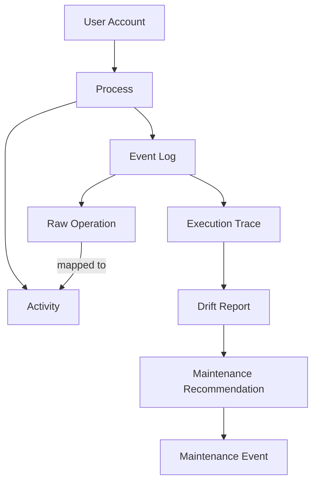
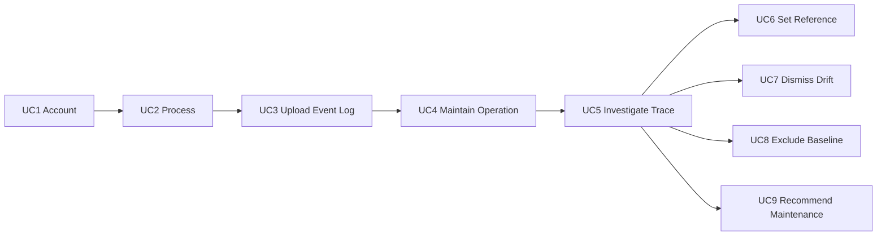

# Deviante Domain

## Purpose

Deviante supports industrial maintenance decision-making by detecting equipment failures before breakdown. It combines process mining (execution trace analysis) with machine learning (drift detection, failure prediction).

**PIBITI context:** Code in `deviante/api` and `deviante/web` are research deliverable artifacts.

## Stewardship

**Alander** is the sole product owner, developer, publisher, and final
decision-maker. Deviante is his PIBITI project and a live product with
commercial and intellectual-property ambition.

**Eduardo Loures** is Alander's PIBITI advisor, a PUCPR Mechatronics
professor, research partner, and qualified tester.

**Luiz Picolo** is a master's researcher working at Bosch, a research
partner, qualified tester, and source of relevant ADWIN/dataset work.

Eduardo and Luiz provide research collaboration, technical feedback, and
testing. They do not own delivery or publish Deviante. Agent roles are
automation responsibilities, not human team assignments.

## Actors

**Manager** — the industrial maintenance decision-maker who owns processes, uploads logs, reviews drift, and schedules maintenance.

**Mentor** — runtime access role for Eduardo and Luiz as research partners and
qualified testers. Mentors exercise the current happy path and provide expert
feedback; they may view and edit shared Processes but cannot delete them. This
role does not imply product ownership or publication authority. Do not build
Mentor-specific product workflows without a future confirmed UC.

## Core Entities

| Entity | Role |
|--------|------|
| User | Manager account |
| Process | Manufacturing workflow container; **company name** identifies the owning organization |
| Activity | Clean logical label for one or more raw operations |
| Operation | Raw activity name from parsed event log |
| Event Log | Uploaded CSV/XES file — **many per process** (0..n); each upload is its own record with traces and parse status |
| Trace | Single end-to-end execution instance |
| Drift | Detected behavioral deviation |
| Baseline | Statistical reference built from historical traces |
| Maintenance Recommendation | Suggested preventive action from drift investigation |

### Analysis scope

A **Process** is the root context from which an analysis starts; it is not
necessarily the statistical unit sent to IPDD/ADWIN. A run may project the
whole-process/whole-trace duration or the per-Trace sojourn time of one or more
mapped **Activities**, and may narrow the Trace population. Projection,
population, event-log version, and detector parameters are separate inputs.
They must be explicit and persisted as result provenance; do not infer an
Activity target only from a list of exclusions. In particular, selecting one
Activity must remain distinct from process-level analysis when it is the only
mapped Activity.

Treat **Trace** as the canonical end-to-end execution instance.
**Cycle/window** remains a provisional group of ordered traces: do not rename
schema objects, change the semantics of UC5-UC9, or claim that a cycle contains traces as
settled domain truth until Luiz/Eduardo's research references and the real
datasets validate the relationship.

In the UI, hiding a trace or variant is only a visualization control. It must
not be conflated with the persisted actions **Dismiss drift** (UC7) or
**Exclude trace from baseline** (UC8).

## Persistence (PostgreSQL)

Deviante data lives in schema `deviante` on the shared Gestalt database. DDL: `data/schema/deviante/`.

| Entity | Table | Notes |
|--------|-------|-------|
| User (auth) | `deviante.users` | email; password_hash nullable (OAuth) |
| Manager (profile) | `deviante.managers` | full_name |
| Process | `deviante.processes` | UC2 — name, **company_name**, description, sector |
| Activity | `deviante.activities` | UC3 |
| Equipment | `deviante.equipment` | singular; supporting object shared by UC2, UC3 and UC9 |

All SQL and API queries must use the `deviante.` prefix. See [database.md](../gestalt-database/reference.md).

## Use cases (derived navigation aid only)

The **only source of truth** for Deviante use cases is live
`portfolio.use_cases` (+ steps and requirements). The valid product set is
`ABP-DV-UC1` through `ABP-DV-UC9`. Historical rows UC10-UC14 remain in the
database as deprecated records and must never be treated as current scope.
This section is only a compact navigation aid; query the database before
authoring or implementing a UC.

## Use Case Summaries

| UC | Name | Type | Summary |
|----|------|------|---------|
| UC1 | Maintain user account | Primary | Sign-in (e-mail/password, Google), sign-up, complete profile, edit profile, sign out |
| UC2 | Maintain process | Primary | CRUD manufacturing processes |
| UC3 | Upload event log | Extension of UC2 | Attach CSV/XES data to a Process or Equipment context |
| UC4 | Maintain operation | Included by UC3 | Map raw labels to clean Operations |
| UC5 | Investigate execution trace | Primary | Inspect a flagged trace and its persisted analysis evidence |
| UC6 | Set reference execution | Extension of UC5 | Mark a trace as the reference baseline |
| UC7 | Dismiss drift | Extension of UC5 | Mark a drift alert as false positive |
| UC8 | Exclude from baseline | Extension of UC5 | Remove an outlier trace from future baseline input |
| UC9 | Recommend maintenance | Extension of UC5 | Turn analysis evidence into a proactive maintenance recommendation |

## Technical Stack

| Layer | Technology | Path |
|-------|------------|------|
| API | Kotlin, Ktor | `deviante/api/` |
| Web | React, Vite | `deviante/web/` |
| Log parsing | PM4Py (referenced in UC4) | API service |
| Drift detection | IPDD, ADWIN — implemented by `deviante/Adaptive-Detection-of-Performance-Related-Temporal-Drifts-main/` (Luiz Picolo's thesis codebase; supports UC5 and UC9) | API service |

## Data Flow

1. Manager creates account (UC1) and process (UC2) — **no log file required**
2. Manager uploads one or more event logs (UC3) → each upload is parsed into operations and traces for that process or equipment context
3. Explicit operation mapping (UC4) cleans the dataset using the
   global Activity catalog; Activities are not created silently
4. The analysis capability persists drift, probability, RUL, scope and provenance as evidence
5. Manager investigates flagged traces (UC5) and takes action (UC6-UC9)
6. Recommendations and schedules remain linked to Equipment and their originating analysis evidence

## Predictive maintenance dependency (added 21/07/2026)

The vendored repo `deviante/Adaptive-Detection-of-Performance-Related-Temporal-Drifts-main/`
is Luiz Picolo's master's-thesis codebase (river/ADWIN + PM4Py) — the
concrete implementation behind IPDD drift detection and supplies computation
used by the current nine-UC product scope:

- Predictive analysis / failure identification per machine.
- Windowing expressed as a **percentage** — probability that a given
  machine fails within a window, not just a binary drift flag.

This is a real dependency, not a citation: the FastAPI compute service
described in [architecture.md § Process mining
exception](../../docs/architecture.md) wraps it. Alander's scope is a PIBITI
product integration effort connecting research computation to industrial
decision-making through a live system. The IPDD research originates with
Denise Sato and Edson Ruschel; Luiz's master's work and vendored
implementation are a downstream research dependency. Preserve each
contribution's provenance without representing any research partner as a
Deviante publisher.

Owner decision (04/08/2026): RUL and failure probability are persisted
outputs of an Analysis, surfaced on Equipment/Monitoring views and consumed
as evidence by UC5 and UC9. They do not create UC10 or any later UC. Equipment
is an independent catalog object that may exist before Process or Monitoring;
associations are explicit rather than ownership inferred from navigation.
